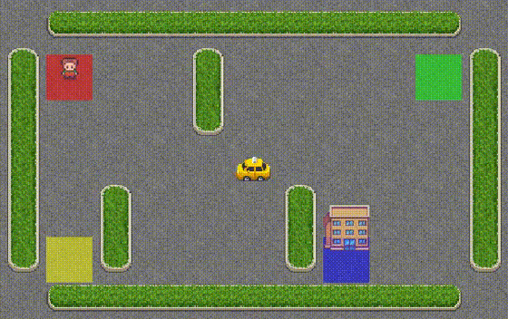

# Taxi-v3-Reinforcement-Learning
# Deep Q-Network (DQN) for Taxi-v3 Environment

This repository contains the implementation of a Deep Q-Network (DQN) agent trained to solve the classic reinforcement learning environment, Taxi-v3, from Gymnasium.

## Project Overview

The goal of this project is to demonstrate the application of the DQN algorithm to a discrete action space reinforcement learning problem. The Taxi-v3 environment involves picking up and dropping off passengers at designated locations. The agent learns to navigate the grid world, pick up the passenger at their starting location, drive to the destination, and drop them off, while avoiding illegal moves and minimizing trip time.

## Key Features

- Implementation of a DQN model using PyTorch.
- Utilization of a replay buffer for experience replay during training.
- Training loop with epsilon-greedy policy for exploration.
- Evaluation of the trained agent's performance.
- Option to record the agent's performance as a video.

## Environment

The project uses the Taxi-v3 environment from the Gymnasium library.

## Getting Started

### Prerequisites

- Python 3.6+
- Gymnasium
- PyTorch
- NumPy
- Matplotlib
- Imageio (with ffmpeg plugin for video recording)

## 🎥 Project Demo

  

  <em>This GIF demonstrates how the system processes real-time data and generates predictions efficiently.</em>

